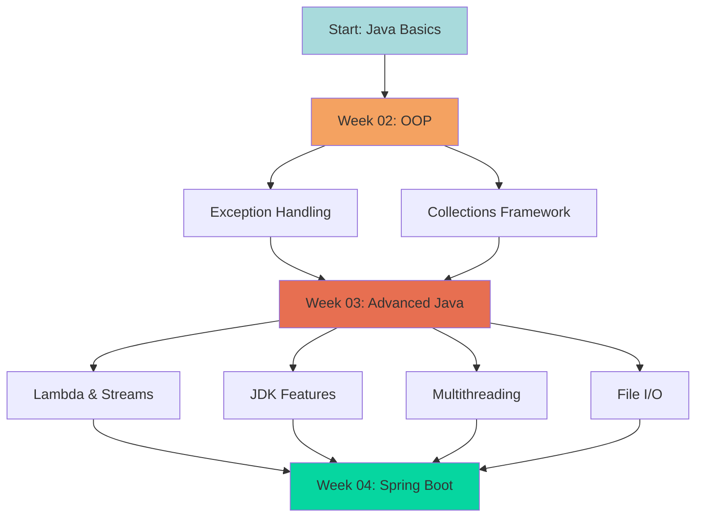

# 🎓 Java Full Stack Developer Training - Visual Learning Guide

> **HeadFirst Java-Style Visual Documentation**  
> Learn Java through engaging diagrams, visual flows, and interactive examples!

---

## 🗺️ Complete Training Map

```
╔═══════════════════════════════════════════════════════════════════════╗
║         JAVA FULL STACK DEVELOPER - 12 WEEK JOURNEY                   ║
╠═══════════════════════════════════════════════════════════════════════╣
║                                                                        ║
║  WEEK 01 [✓] Java Fundamentals                                       ║
║   └─ Basics, Control Flow, Arrays, OOP Introduction                  ║
║                                                                        ║
║  WEEK 02 [✓] OOP & Collections ⭐ VISUAL GUIDE AVAILABLE             ║
║   ├─ Inheritance & Polymorphism                                       ║
║   ├─ Exception Handling (6 examples + diagrams)                       ║
║   └─ Collections Framework (8 examples + diagrams)                    ║
║   📚 [See WEEK-02-VISUAL-GUIDE.md]                                    ║
║                                                                        ║
║  WEEK 03 [✓] Advanced Java ⭐ VISUAL GUIDE AVAILABLE                 ║
║   ├─ Lambda & Streams (16 examples + pipeline diagrams)               ║
║   ├─ JDK 8/11/17/21 Features (16 examples + evolution charts)         ║
║   ├─ Multithreading Part 1 (9 examples + lifecycle diagrams)          ║
║   ├─ Multithreading Part 2 (7 examples + concurrency patterns)        ║
║   └─ File I/O (5 examples + stream hierarchies)                       ║
║   📚 [See WEEK-03-VISUAL-GUIDE.md]                                    ║
║                                                                        ║
║  WEEK 04-12 [  ] Coming Soon                                          ║
║   └─ Spring Boot, Microservices, React, DevOps                        ║
║                                                                        ║
╚═══════════════════════════════════════════════════════════════════════╝
```

---

## 🎨 Visual Learning Features

This repository includes **HeadFirst Java-style** visual documentation:

```
┌──────────────────────────────────────────────────────────┐
│            VISUAL LEARNING MATERIALS                      │
├──────────────────────────────────────────────────────────┤
│                                                          │
│  📊 ASCII Art Diagrams                                   │
│   └─ Visual concept maps and flows                      │
│                                                          │
│  🎨 Mermaid Diagrams                                     │
│   ├─ Flowcharts for processes                           │
│   ├─ Sequence diagrams for interactions                 │
│   ├─ Class diagrams for hierarchies                     │
│   └─ State diagrams for lifecycles                      │
│                                                          │
│  🔄 Before/After Comparisons                             │
│   └─ Show improvements and best practices               │
│                                                          │
│  🎯 Step-by-Step Visual Explanations                    │
│   └─ Break down complex concepts                        │
│                                                          │
│  📝 Quick Reference Cards                                │
│   └─ Cheat sheets for rapid review                      │
│                                                          │
│  ✅ Best Practices Checklists                            │
│   └─ Do's and Don'ts with emojis                        │
│                                                          │
└──────────────────────────────────────────────────────────┘
```

---

## 📚 Available Visual Guides

### Day-Level Guides (Detailed)

1. **[Week-02 Day-08: Exception Handling](Week-02-OOP/Day-08-Exception-Handling/README.md)**
   - Try-Catch-Finally theater
   - Exception hierarchy diagram
   - Try-with-resources magic
   - Deadlock prevention

2. **[Week-02 Day-09: Collections](Week-02-OOP/Day-09-Collections/README.md)**
   - Collections universe map
   - ArrayList vs LinkedList battle
   - HashMap internals
   - Performance comparison charts

3. **[Week-03 Day-11: Lambda & Streams](Week-03-Advanced-Java/Day-11-Lambda-Streams/README.md)**
   - Lambda evolution timeline
   - Stream pipeline assembly line
   - Method references shortcuts
   - Parallel streams visualization

4. **[Week-03 Day-13: Multithreading](Week-03-Advanced-Java/Day-13-Multithreading-Part1/README.md)**
   - Thread lifecycle states
   - Race condition demo
   - Deadlock scenarios
   - Wait-notify mechanism

5. **[Week-03 Day-15: File I/O](Week-03-Advanced-Java/Day-15-File-IO/README.md)**
   - Stream hierarchy
   - Buffered vs unbuffered
   - Serialization process
   - Old I/O vs NIO

### Week-Level Guides (Overview)

- **[Week-02 Visual Guide](Week-02-OOP/WEEK-02-VISUAL-GUIDE.md)** - OOP & Collections
- **[Week-03 Visual Guide](Week-03-Advanced-Java/WEEK-03-VISUAL-GUIDE.md)** - Advanced Java

---

## 📊 Repository Statistics

```
╔══════════════════════════════════════════════════════════╗
║              TRAINING REPOSITORY STATS                    ║
╠══════════════════════════════════════════════════════════╣
║                                                          ║
║  📁 Total Examples:        67                           ║
║  📚 Visual Guides:         7                            ║
║  🎨 Mermaid Diagrams:      15+                          ║
║  📊 ASCII Art Diagrams:    25+                          ║
║  📦 Sub-packages:          30+                          ║
║  📝 Lines of Code:         8000+                        ║
║  ⚡ Code Examples:         Production-ready             ║
║                                                          ║
║  Weeks Covered:            2/12 (with visual docs)      ║
║  Days with Examples:       5 days (fully documented)    ║
║  Completion:               17% with visuals             ║
║                                                          ║
╚══════════════════════════════════════════════════════════╝
```

---

## 🎯 How to Use This Guide

```
1️⃣ Start with Week Overview
   └─ Read WEEK-XX-VISUAL-GUIDE.md

2️⃣ Dive into Day Details
   └─ Open Day-XX/README.md for visual explanations

3️⃣ Study Code Examples
   └─ Run and experiment with ExampleXX.java files

4️⃣ Practice with Variations
   └─ Modify examples to test understanding

5️⃣ Review Quick References
   └─ Use cheat sheets for rapid revision
```

---

## 🚀 Quick Navigation

### By Topic

- **Exception Handling** → [Week-02/Day-08](Week-02-OOP/Day-08-Exception-Handling/)
- **Collections** → [Week-02/Day-09](Week-02-OOP/Day-09-Collections/)
- **Lambda & Streams** → [Week-03/Day-11](Week-03-Advanced-Java/Day-11-Lambda-Streams/)
- **JDK Features** → [Week-03/Day-12](Week-03-Advanced-Java/Day-12-JDK-Features/)
- **Multithreading** → [Week-03/Day-13](Week-03-Advanced-Java/Day-13-Multithreading-Part1/)
- **File I/O** → [Week-03/Day-15](Week-03-Advanced-Java/Day-15-File-IO/)

### By Type

- **Visual Guides** → All README.md files
- **Code Examples** → ExampleXX.java files
- **Progress** → [PROGRESS-SUMMARY.md](PROGRESS-SUMMARY.md)

---

## ✨ What Makes This Special?

```
╔════════════════════════════════════════════════════════════╗
║              UNIQUE FEATURES                               ║
╠════════════════════════════════════════════════════════════╣
║                                                            ║
║  🎨 HeadFirst Java Style                                  ║
║   └─ Engaging, visual, memory-friendly                   ║
║                                                            ║
║  🎯 Multiple Learning Styles                              ║
║   ├─ Visual (diagrams)                                    ║
║   ├─ Kinesthetic (code examples)                          ║
║   └─ Reading (explanations)                               ║
║                                                            ║
║  📊 Before/After Patterns                                 ║
║   └─ See improvements clearly                            ║
║                                                            ║
║  ⚡ Quick Reference Cards                                 ║
║   └─ Rapid revision support                              ║
║                                                            ║
║  ✅ Best Practices Built-In                               ║
║   └─ Learn correct way from start                        ║
║                                                            ║
║  🎬 Real-World Scenarios                                  ║
║   └─ Production-ready examples                           ║
║                                                            ║
╚════════════════════════════════════════════════════════════╝
```

---

## 🎓 Learning Path Visualization



---

## 📖 Recommended Learning Sequence

1. **Exception Handling** (Day-08) - Foundation for error handling
2. **Collections** (Day-09) - Data structures mastery
3. **Lambda & Streams** (Day-11) - Modern Java programming
4. **JDK Features** (Day-12) - Version-specific features
5. **Multithreading** (Day-13-14) - Concurrent programming
6. **File I/O** (Day-15) - Data persistence

---

## 🎉 Achievement Badges

```
╔════════════════════════════════════════════════════════════╗
║                  YOUR PROGRESS                             ║
╠════════════════════════════════════════════════════════════╣
║                                                            ║
║  🏆 Exception Handler                                     ║
║   └─ Master of try-catch-finally                         ║
║                                                            ║
║  📦 Collections Expert                                    ║
║   └─ Know when to use what                               ║
║                                                            ║
║  🌊 Stream Warrior                                        ║
║   └─ Functional programming pro                          ║
║                                                            ║
║  🧵 Thread Master                                         ║
║   └─ Concurrent programming expert                       ║
║                                                            ║
║  📁 I/O Specialist                                        ║
║   └─ File handling ninja                                 ║
║                                                            ║
╚════════════════════════════════════════════════════════════╝
```

---

## 🚀 Get Started Now!

```bash
# Clone the repository
git clone <repository-url>

# Start with Week-02 visual guide
cd Training
cat Week-02-OOP/WEEK-02-VISUAL-GUIDE.md

# Or Week-03 advanced topics
cat Week-03-Advanced-Java/WEEK-03-VISUAL-GUIDE.md

# Run your first example
cd Week-02-OOP/Day-08-Exception-Handling
javac basics/Example01_TryCatchBasics.java
java basics.Example01_TryCatchBasics
```

---

## 💡 Pro Tips

- 📚 Always read the README.md before diving into code
- 🎨 Visualize concepts using the provided diagrams
- ⚡ Run every example to see it in action
- 🔄 Modify examples to test your understanding
- ✅ Use quick reference cards for revision

---

**Happy Visual Learning! 🎨🚀**

*Created with ❤️ using HeadFirst Java principles*
