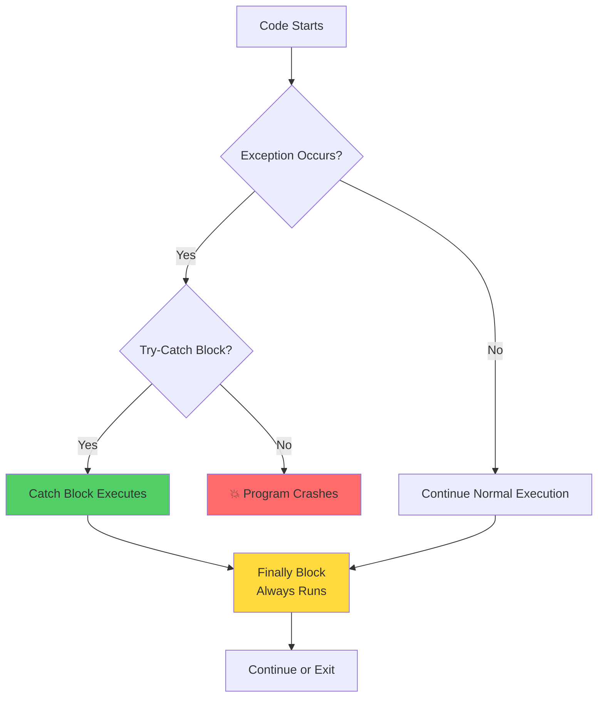
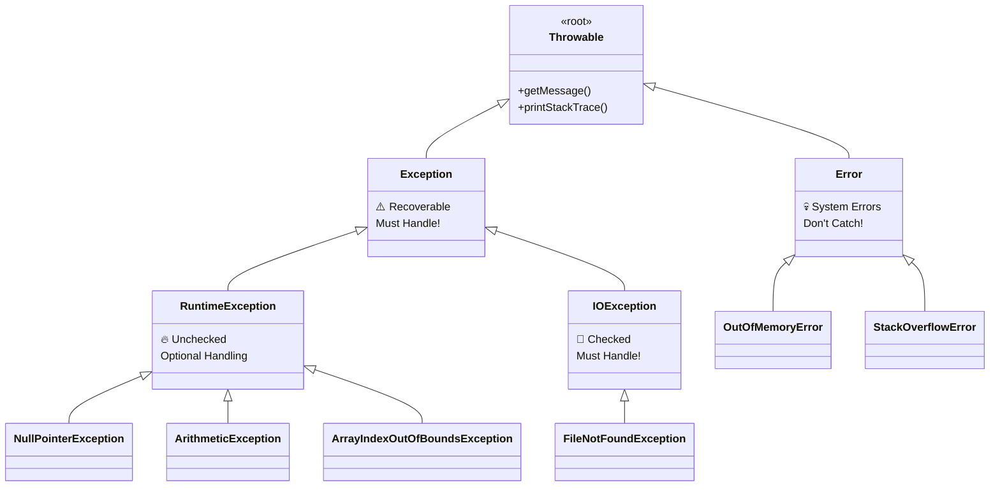
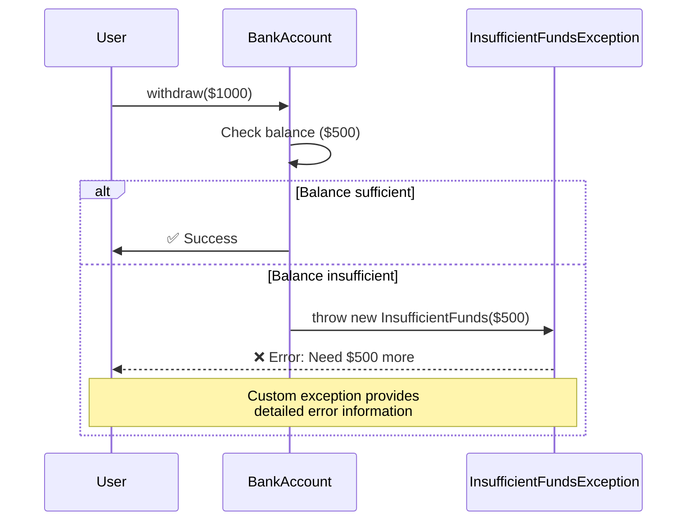

# 🎯 Day 08: Exception Handling - Visual Guide

## 📚 What You'll Learn Today

Exception handling is like having a safety net when walking on a tightrope - it catches you when things go wrong!

---

## 🎨 Visual Concept Map

```
┌─────────────────────────────────────────────────────────────┐
│                    EXCEPTION HANDLING                        │
│                                                              │
│  ┌──────────────┐         ┌──────────────┐                 │
│  │   NORMAL     │         │   WITH       │                 │
│  │   FLOW       │         │  EXCEPTION   │                 │
│  │              │         │   HANDLING   │                 │
│  │  Step 1 ✓    │         │  Step 1 ✓    │                 │
│  │  Step 2 ✓    │         │  Step 2 ✗    │                 │
│  │  Step 3 ✓    │         │  ↓           │                 │
│  │  Step 4 ✓    │         │  CATCH! 🎣   │                 │
│  │              │         │  Handle it   │                 │
│  │  SUCCESS ✓   │         │  Step 3 ✓    │                 │
│  └──────────────┘         │  Step 4 ✓    │                 │
│                           │  SUCCESS ✓   │                 │
│                           └──────────────┘                 │
└─────────────────────────────────────────────────────────────┘
```

---

## 🔄 Exception Flow Diagram



---

## 🎪 Try-Catch-Finally Theater

```
╔═══════════════════════════════════════════════════════════╗
║                  THE TRY-CATCH-FINALLY SHOW               ║
╠═══════════════════════════════════════════════════════════╣
║                                                           ║
║  🎬 ACT 1: TRY                                           ║
║  ┌─────────────────────────────────────┐                ║
║  │ try {                                │                ║
║  │    // Risky code goes here          │                ║
║  │    int result = 10 / 0;  // Oops!   │  💥           ║
║  │ }                                    │                ║
║  └─────────────────────────────────────┘                ║
║           │                                              ║
║           ↓ (Exception thrown!)                         ║
║                                                           ║
║  🎭 ACT 2: CATCH                                         ║
║  ┌─────────────────────────────────────┐                ║
║  │ catch (ArithmeticException e) {     │                ║
║  │    // Safety net catches it! 🎣     │  ✅           ║
║  │    System.out.println("Error!");    │                ║
║  │ }                                    │                ║
║  └─────────────────────────────────────┘                ║
║           │                                              ║
║           ↓                                              ║
║                                                           ║
║  🎬 ACT 3: FINALLY                                       ║
║  ┌─────────────────────────────────────┐                ║
║  │ finally {                            │                ║
║  │    // Always runs! 🏃‍♂️              │  🎯           ║
║  │    // Cleanup code here              │                ║
║  │ }                                    │                ║
║  └─────────────────────────────────────┘                ║
║                                                           ║
║  🎉 THE END - Program continues!                         ║
╚═══════════════════════════════════════════════════════════╝
```

---

## 🏗️ Exception Hierarchy



---

## 📊 Checked vs Unchecked - The Battle!

```
╔══════════════════════════════════════════════════════════════╗
║           CHECKED vs UNCHECKED EXCEPTIONS                     ║
╠══════════════════════════════════════════════════════════════╣
║                                                               ║
║  CHECKED ✋ (Compile-time)    │    UNCHECKED 🚀 (Runtime)    ║
║  ═════════════════════════    │    ═══════════════════════   ║
║                               │                               ║
║  📁 IOException               │    💥 NullPointerException    ║
║  🔌 SQLException              │    🔢 ArithmeticException     ║
║  🌐 ClassNotFoundException    │    📊 ArrayIndexOutOfBounds  ║
║                               │                               ║
║  ⚠️  MUST handle or declare   │    ✨ Optional to handle     ║
║                               │                               ║
║  try {                        │    // No forced handling      ║
║    FileReader fr = ...        │    int x = 10 / 0;           ║
║  } catch (IOException e) {    │    // Compiles fine!         ║
║    // Required!               │    // Crashes at runtime     ║
║  }                            │                               ║
║                               │                               ║
║  🎯 When: Recoverable errors  │    🎯 When: Programming bugs ║
║  📚 Example: File not found   │    📚 Example: Null access   ║
╚══════════════════════════════════════════════════════════════╝
```

---

## 🎯 Try-With-Resources Magic

```
┌─────────────────────────────────────────────────────────┐
│            BEFORE (Old Way - Manual Cleanup)            │
├─────────────────────────────────────────────────────────┤
│                                                         │
│  FileReader reader = null;                             │
│  try {                                                  │
│      reader = new FileReader("file.txt");  ──┐         │
│      // Use reader                            │         │
│  } catch (IOException e) {                    │         │
│      e.printStackTrace();                     │         │
│  } finally {                                  │         │
│      try {                                    │         │
│          if (reader != null) {                │         │
│              reader.close();  ◄───────────────┘         │
│          }                    😰 So much code!          │
│      } catch (IOException e) {                          │
│          e.printStackTrace();                           │
│      }                                                   │
│  }                                                       │
└─────────────────────────────────────────────────────────┘

                        ⬇️ UPGRADE! ⬇️

┌─────────────────────────────────────────────────────────┐
│           AFTER (New Way - Auto Cleanup) 🎉             │
├─────────────────────────────────────────────────────────┤
│                                                         │
│  try (FileReader reader = new FileReader("file.txt")) {│
│      // Use reader                                      │
│      // Auto-closes! 🪄                                 │
│  } catch (IOException e) {                              │
│      e.printStackTrace();                               │
│  }                                                       │
│                                                         │
│  ✅ Cleaner code                                        │
│  ✅ No manual close()                                   │
│  ✅ No finally block needed                             │
│  ✅ Multiple resources: try (R1 r1; R2 r2) {...}       │
└─────────────────────────────────────────────────────────┘
```

---

## 🎨 Custom Exception Design



---

## 🔗 Exception Chaining

```
┌───────────────────────────────────────────────────────┐
│              EXCEPTION CHAINING                        │
│                                                        │
│  Low-Level Exception  ──┐                            │
│         ↓                │                            │
│  Wrapped in            │  Preserves                 │
│  High-Level Exception  │  Stack Trace!              │
│         ↓                │                            │
│  Caught by Caller      │                            │
│                        ↓                            │
│                                                        │
│  try {                                                 │
│      // Low level                                      │
│      database.connect();  💥 SQLException             │
│  } catch (SQLException e) {                           │
│      // Wrap it!                                       │
│      throw new DataAccessException(                   │
│          "Failed to connect", e  ◄─── Original cause │
│      );                                                │
│  }                                                     │
│                                                        │
│  Benefits:                                             │
│  ✅ Keep full error details                           │
│  ✅ Abstract implementation                            │
│  ✅ Better error messages                              │
└───────────────────────────────────────────────────────┘
```

---

## 🎓 Best Practices Checklist

```
✅ DO:
   ✓ Catch specific exceptions (not Exception)
   ✓ Use try-with-resources for AutoCloseable
   ✓ Log exceptions properly
   ✓ Clean up resources in finally
   ✓ Create meaningful custom exceptions
   ✓ Preserve stack traces when chaining

❌ DON'T:
   ✗ Catch and ignore (empty catch block)
   ✗ Catch Exception or Throwable
   ✗ Use exceptions for control flow
   ✗ Throw generic exceptions
   ✗ Swallow exceptions without logging
   ✗ Have too broad catch blocks
```

---

## 📁 Examples in This Module

1. **Example01_TryCatchBasics.java** - Basic exception handling
2. **Example02_FinallyBlock.java** - Finally block usage
3. **Example03_CustomExceptions.java** - Creating custom exceptions
4. **Example04_TryWithResources.java** - Auto-closeable resources
5. **Example05_ExceptionChaining.java** - Wrapping exceptions
6. **Example06_CheckedVsUnchecked.java** - Exception types

---

## 🚀 Quick Reference Card

```
╔══════════════════════════════════════════════════════╗
║              EXCEPTION HANDLING CHEAT SHEET          ║
╠══════════════════════════════════════════════════════╣
║                                                      ║
║  TRY         → Risky code goes here                 ║
║  CATCH       → Handle specific exceptions           ║
║  FINALLY     → Always runs (cleanup)                ║
║  THROW       → Create and throw exception           ║
║  THROWS      → Declare method may throw             ║
║                                                      ║
║  try { }                  Single try                ║
║  catch (E e) { }          Catch one type            ║
║  catch (E1 | E2 e) { }    Multi-catch (Java 7+)     ║
║  finally { }              Cleanup code              ║
║                                                      ║
║  try (Resource r = ...) { }  Auto-close (Java 7+)   ║
║                                                      ║
╚══════════════════════════════════════════════════════╝
```

---

## 🎯 Learning Path


Happy Exception Handling! 🎉
