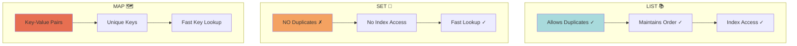
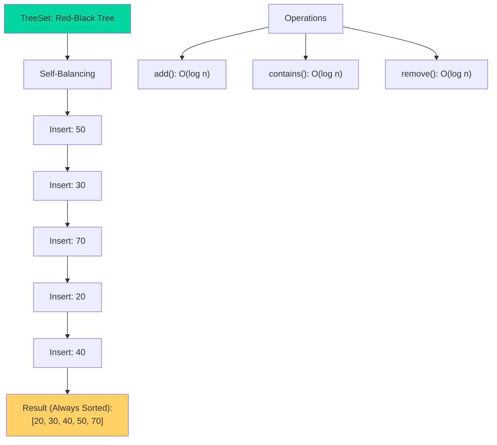
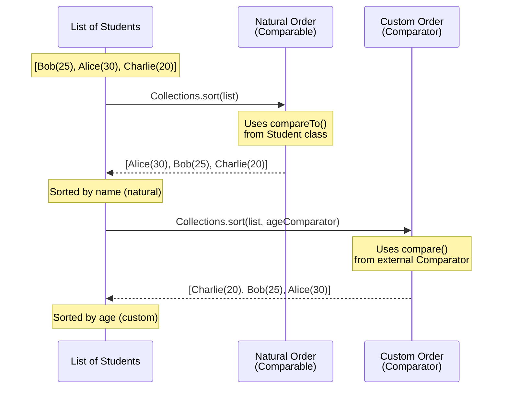

# 🎯 Day 09: Collections Framework - Visual Guide

## 📚 What You'll Learn Today

Collections are like different types of containers - each designed for specific storage needs!

---

## 🎨 Collections Framework Universe

```
╔═══════════════════════════════════════════════════════════════════╗
║              JAVA COLLECTIONS FRAMEWORK UNIVERSE                   ║
╠═══════════════════════════════════════════════════════════════════╣
║                                                                    ║
║                        Collection                                  ║
║                            │                                       ║
║          ┌─────────────────┼─────────────────┐                   ║
║          │                 │                 │                    ║
║        List               Set               Queue                 ║
║          │                 │                 │                    ║
║    ┌─────┴─────┐     ┌─────┴─────┐    ┌─────┴─────┐            ║
║    │           │     │           │    │           │             ║
║ ArrayList  LinkedList  HashSet TreeSet  PriorityQueue           ║
║    📚         🔗        🎯       🌲        ⚡                      ║
║  Indexed    Double    Unique   Sorted   Priority               ║
║  Access     Linked     Items   Order    Based                  ║
║                                                                    ║
║                          Map (Separate)                           ║
║                            │                                       ║
║                  ┌─────────┴─────────┐                           ║
║                  │                   │                            ║
║              HashMap              TreeMap                         ║
║                🗺️                  🗺️🌲                           ║
║             Key-Value            Sorted Keys                     ║
║                                                                    ║
╚═══════════════════════════════════════════════════════════════════╝
```

---

## 📊 List vs Set vs Map - The Big Picture



---

## 🎪 ArrayList vs LinkedList - The Showdown!

```
╔═══════════════════════════════════════════════════════════════╗
║                ArrayList vs LinkedList BATTLE                  ║
╠═══════════════════════════════════════════════════════════════╣
║                                                                ║
║  ARRAYLIST 📚                │    LINKEDLIST 🔗                ║
║  ════════════                │    ═══════════                 ║
║                              │                                ║
║  Internal Structure:         │    Internal Structure:         ║
║  ┌───┬───┬───┬───┬───┐     │    ┌───┐  ┌───┐  ┌───┐        ║
║  │ 0 │ 1 │ 2 │ 3 │ 4 │     │    │ A │→ │ B │→ │ C │        ║
║  └───┴───┴───┴───┴───┘     │    └───┘  └───┘  └───┘        ║
║  Continuous Memory          │    Linked Nodes                ║
║                              │                                ║
║  Random Access: ⚡ O(1)      │    Random Access: 🐌 O(n)      ║
║  get(index) - FAST!         │    get(index) - SLOW!          ║
║                              │                                ║
║  Insert/Delete: 🐌 O(n)     │    Insert/Delete: ⚡ O(1)      ║
║  (Shift elements)           │    (Just relink)               ║
║                              │                                ║
║  Memory: 📦 Compact         │    Memory: 📦📦 Extra for links║
║                              │                                ║
║  Best For:                   │    Best For:                   ║
║  ✓ Random access            │    ✓ Frequent add/remove       ║
║  ✓ Iteration                │    ✓ Queue/Stack operations    ║
║  ✓ Small lists              │    ✓ Middle insertions         ║
║                              │                                ║
╚═══════════════════════════════════════════════════════════════╝
```

---

## 🎯 HashSet - No Duplicates Zone!

```
┌──────────────────────────────────────────────────────┐
│              HASHSET - THE BOUNCER 🚫                │
├──────────────────────────────────────────────────────┤
│                                                      │
│  Adding Elements:                                    │
│                                                      │
│  set.add("Apple")   ──→  ✅ Added!                  │
│  set.add("Banana")  ──→  ✅ Added!                  │
│  set.add("Apple")   ──→  ❌ Duplicate! Rejected!    │
│  set.add("Cherry")  ──→  ✅ Added!                  │
│                                                      │
│  Result: ["Apple", "Banana", "Cherry"]              │
│           (No order guaranteed!)                     │
│                                                      │
│  Internal: Uses HashMap underneath                   │
│  ┌────────────────────────────────┐                 │
│  │  Hash Table (Buckets)          │                 │
│  │  ┌────┬────┬────┬────┐        │                 │
│  │  │ 0  │ 1  │ 2  │ 3  │        │                 │
│  │  └────┴────┴────┴────┘        │                 │
│  │    │    │    │    │            │                 │
│  │  Apple Banana Cherry (hashed) │                 │
│  └────────────────────────────────┘                 │
│                                                      │
│  Operations: O(1) average                           │
│  ✓ add()      - Fast                                │
│  ✓ contains() - Fast                                │
│  ✓ remove()   - Fast                                │
└──────────────────────────────────────────────────────┘
```

---

## 🌲 TreeSet - Always Sorted!



---

## 🗺️ HashMap - The Key-Value Store

```
╔══════════════════════════════════════════════════════════╗
║                  HASHMAP INTERNALS                        ║
╠══════════════════════════════════════════════════════════╣
║                                                           ║
║  map.put("Alice", 95);                                   ║
║  map.put("Bob", 87);                                     ║
║  map.put("Charlie", 92);                                 ║
║                                                           ║
║  Internal Structure:                                      ║
║  ┌─────────────────────────────────────┐                ║
║  │  Hash Table (Array of Buckets)      │                ║
║  │                                      │                ║
║  │  Bucket 0: Empty                    │                ║
║  │  Bucket 1: Empty                    │                ║
║  │  Bucket 2: ["Alice" → 95]           │  ◄─ Hash(Alice)║
║  │  Bucket 3: Empty                    │                ║
║  │  Bucket 4: ["Bob" → 87]             │  ◄─ Hash(Bob)  ║
║  │  Bucket 5: ["Charlie" → 92]         │  ◄─ Hash(Charlie)║
║  │  ...                                 │                ║
║  └─────────────────────────────────────┘                ║
║                                                           ║
║  Get Operation:                                           ║
║  map.get("Alice")                                        ║
║    ↓                                                      ║
║  1. Hash("Alice") → Bucket 2                            ║
║  2. Find key "Alice" in bucket                           ║
║  3. Return value 95                                      ║
║  Time: O(1) average ⚡                                   ║
║                                                           ║
║  Collision Handling:                                      ║
║  If hash("Key1") == hash("Key2"):                       ║
║  Bucket: [Key1→Val1] → [Key2→Val2]  (Linked chain)     ║
║                                                           ║
╚══════════════════════════════════════════════════════════╝
```

---

## 🔄 Collection Operations Visual

```
┌─────────────────────────────────────────────────────────┐
│              COMMON COLLECTION OPERATIONS                │
├─────────────────────────────────────────────────────────┤
│                                                         │
│  ADD 📥                                                 │
│  list.add("Item")         [  ] → ["Item"]              │
│  list.add(0, "First")     ["A","B"] → ["First","A","B"]│
│                                                         │
│  REMOVE 📤                                              │
│  list.remove("Item")      ["A","B","C"] → ["A","C"]    │
│  list.remove(0)           ["A","B","C"] → ["B","C"]    │
│                                                         │
│  GET 🔍                                                 │
│  list.get(0)              ["A","B","C"] → "A"          │
│                                                         │
│  SET 🔄                                                 │
│  list.set(0, "Z")         ["A","B","C"] → ["Z","B","C"]│
│                                                         │
│  SIZE 📏                                                │
│  list.size()              ["A","B","C"] → 3            │
│                                                         │
│  CONTAINS ❓                                            │
│  list.contains("B")       ["A","B","C"] → true         │
│                                                         │
│  CLEAR 🗑️                                               │
│  list.clear()             ["A","B","C"] → []           │
│                                                         │
└─────────────────────────────────────────────────────────┘
```

---

## 🎭 Comparable vs Comparator



---

## 🎯 When to Use What?

```
╔══════════════════════════════════════════════════════════════╗
║              COLLECTION SELECTION GUIDE                       ║
╠══════════════════════════════════════════════════════════════╣
║                                                               ║
║  Need: Fast random access by index?                          ║
║    → Use: ArrayList 📚                                       ║
║                                                               ║
║  Need: Frequent add/remove at beginning/middle?              ║
║    → Use: LinkedList 🔗                                      ║
║                                                               ║
║  Need: Unique elements only?                                 ║
║    → Use: HashSet 🎯                                         ║
║                                                               ║
║  Need: Unique AND sorted elements?                           ║
║    → Use: TreeSet 🌲                                         ║
║                                                               ║
║  Need: Key-value pairs with fast lookup?                     ║
║    → Use: HashMap 🗺️                                         ║
║                                                               ║
║  Need: Key-value pairs with sorted keys?                     ║
║    → Use: TreeMap 🗺️🌲                                       ║
║                                                               ║
║  Need: FIFO queue?                                            ║
║    → Use: LinkedList or ArrayDeque ⚡                        ║
║                                                               ║
║  Need: Priority-based processing?                            ║
║    → Use: PriorityQueue 🎪                                   ║
║                                                               ║
╚══════════════════════════════════════════════════════════════╝
```

---

## 📊 Performance Comparison

```
┌───────────────────────────────────────────────────────────┐
│              TIME COMPLEXITY CHEAT SHEET                   │
├───────────────────────────────────────────────────────────┤
│                                                           │
│  Operation    │ ArrayList │ LinkedList │ HashSet │ TreeSet│
│  ────────────┼───────────┼────────────┼─────────┼────────│
│  add()       │    O(1)*  │    O(1)    │  O(1)   │ O(logn)│
│  add(index)  │    O(n)   │    O(n)    │   N/A   │   N/A  │
│  get(index)  │    O(1)   │    O(n)    │   N/A   │   N/A  │
│  contains()  │    O(n)   │    O(n)    │  O(1)   │ O(logn)│
│  remove()    │    O(n)   │    O(n)    │  O(1)   │ O(logn)│
│  iterator    │    O(n)   │    O(n)    │  O(n)   │  O(n)  │
│                                                           │
│  * Amortized (may resize array)                          │
│                                                           │
│  Legend:                                                  │
│  O(1)    - Constant time     ⚡ Lightning fast            │
│  O(logn) - Logarithmic time  🚀 Very fast                │
│  O(n)    - Linear time       🐌 Slower for large n       │
└───────────────────────────────────────────────────────────┘
```

---

## 🎨 Iteration Patterns

```java
// 1️⃣ For-each loop (Best for readability)
for (String item : list) {
    System.out.println(item);
}

// 2️⃣ Iterator (Safe removal during iteration)
Iterator<String> it = list.iterator();
while (it.hasNext()) {
    String item = it.next();
    if (item.equals("remove")) {
        it.remove();  // ✅ Safe
    }
}

// 3️⃣ Traditional for loop (Index needed)
for (int i = 0; i < list.size(); i++) {
    System.out.println(list.get(i));
}

// 4️⃣ Lambda forEach (Java 8+)
list.forEach(item -> System.out.println(item));

// 5️⃣ Streams (Functional style)
list.stream()
    .filter(item -> item.length() > 3)
    .forEach(System.out::println);
```

---

## 📁 Examples in This Module

1. **Example01_ArrayList.java** - ArrayList operations
2. **Example02_HashSet.java** - Set operations and uniqueness
3. **Example03_HashMap.java** - Key-value pair storage
4. **Example04_LinkedList.java** - LinkedList as List/Queue/Stack
5. **Example05_ComparableComparator.java** - Custom sorting
6. **Example06_QueueDemo.java** - FIFO queue operations
7. **Example07_TreeMap.java** - Sorted map
8. **Example08_TreeSet.java** - Sorted set

---

## 🚀 Quick Reference

```
╔════════════════════════════════════════════════════════╗
║         COLLECTIONS FRAMEWORK CHEAT SHEET              ║
╠════════════════════════════════════════════════════════╣
║                                                        ║
║  List<E> list = new ArrayList<>();                    ║
║  Set<E> set = new HashSet<>();                        ║
║  Map<K,V> map = new HashMap<>();                      ║
║  Queue<E> queue = new LinkedList<>();                 ║
║                                                        ║
║  // Common Operations                                 ║
║  collection.add(item)        // Add element           ║
║  collection.remove(item)     // Remove element        ║
║  collection.contains(item)   // Check existence       ║
║  collection.size()           // Get size              ║
║  collection.clear()          // Remove all            ║
║  collection.isEmpty()        // Check if empty        ║
║                                                        ║
║  // Map Operations                                    ║
║  map.put(key, value)         // Add pair              ║
║  map.get(key)                // Get value             ║
║  map.containsKey(key)        // Check key             ║
║  map.keySet()                // Get all keys          ║
║  map.values()                // Get all values        ║
║  map.entrySet()              // Get key-value pairs   ║
║                                                        ║
╚════════════════════════════════════════════════════════╝
```

Happy Collecting! 🎉
