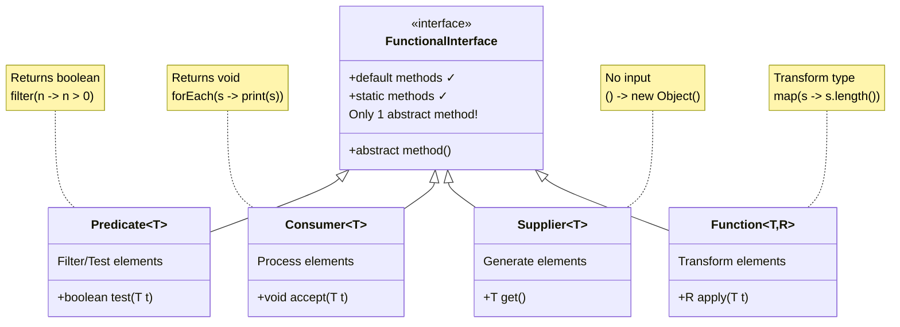
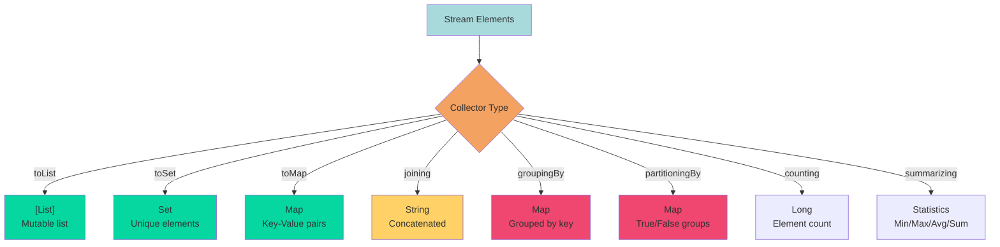
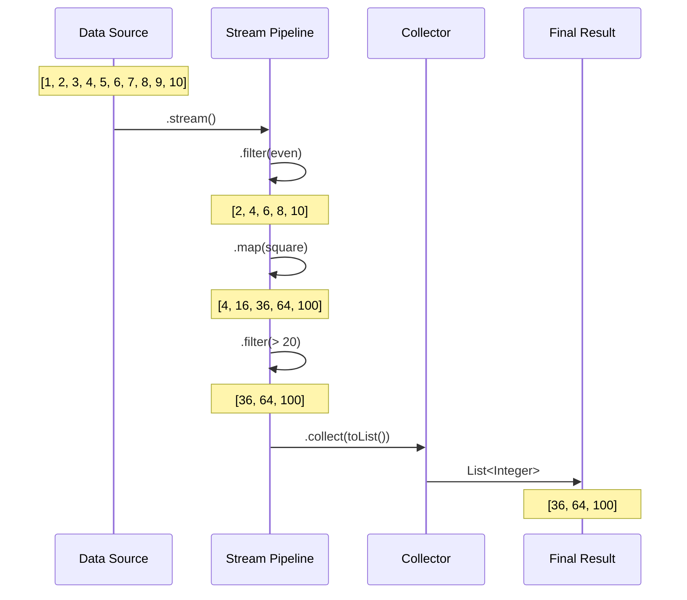

# 🎯 Day 11: Lambda & Streams - Visual Guide

## 📚 What You'll Learn Today

Lambda expressions are like superpowers for your code - write less, do more!

---

## 🎨 Lambda Evolution Timeline

```
╔════════════════════════════════════════════════════════════════╗
║              FROM VERBOSE TO CONCISE                            ║
╠════════════════════════════════════════════════════════════════╣
║                                                                 ║
║  📅 JAVA 7 (Old Way - Anonymous Class) 😰                     ║
║  ┌────────────────────────────────────────────────────────┐   ║
║  │ Runnable r = new Runnable() {                          │   ║
║  │     @Override                                           │   ║
║  │     public void run() {                                │   ║
║  │         System.out.println("Hello");                   │   ║
║  │     }                                                    │   ║
║  │ };                                                       │   ║
║  └────────────────────────────────────────────────────────┘   ║
║  Lines: 6  😱                                                  ║
║                                                                 ║
║                    ⬇️ UPGRADE TO JAVA 8! ⬇️                    ║
║                                                                 ║
║  📅 JAVA 8 (Lambda Expression) 🎉                             ║
║  ┌────────────────────────────────────────────────────────┐   ║
║  │ Runnable r = () -> System.out.println("Hello");        │   ║
║  └────────────────────────────────────────────────────────┘   ║
║  Lines: 1  ✨ 83% less code!                                  ║
║                                                                 ║
╚════════════════════════════════════════════════════════════════╝
```

---

## 🔬 Lambda Anatomy

```
┌─────────────────────────────────────────────────────────────┐
│              LAMBDA EXPRESSION BREAKDOWN                     │
├─────────────────────────────────────────────────────────────┤
│                                                             │
│   (parameters) -> { body }                                  │
│    ────┬────      ─┬─  ───┬───                            │
│        │           │      │                                │
│        │           │      └─ What to do                    │
│        │           └──────── Lambda arrow                  │
│        └──────────────────── Input parameters              │
│                                                             │
│  Examples:                                                  │
│                                                             │
│  1️⃣ No parameters:                                         │
│     () -> System.out.println("Hello")                      │
│     └┬┘                                                     │
│      └─ Empty parentheses required                         │
│                                                             │
│  2️⃣ One parameter:                                         │
│     x -> x * 2                                             │
│     └┬┘                                                     │
│      └─ Parentheses optional                               │
│                                                             │
│  3️⃣ Multiple parameters:                                   │
│     (x, y) -> x + y                                        │
│     └──┬──┘                                                 │
│        └─ Parentheses required                             │
│                                                             │
│  4️⃣ Multiple statements:                                   │
│     (x, y) -> {                                            │
│         int sum = x + y;                                   │
│         return sum;                                         │
│     }                                                       │
│     └──┬──┘                                                 │
│        └─ Braces + return required                         │
│                                                             │
└─────────────────────────────────────────────────────────────┘
```

---

## 🎭 Functional Interfaces - The Foundation



---

## 🌊 Stream Pipeline - The Assembly Line

```
╔════════════════════════════════════════════════════════════════╗
║                  STREAM PROCESSING PIPELINE                     ║
╠════════════════════════════════════════════════════════════════╣
║                                                                 ║
║  Source  →  Intermediate Operations  →  Terminal Operation     ║
║   ┃              (Can chain many)           (Only one)         ║
║   ┃                    ┃                        ┃               ║
║   ┃                    ┃                        ┃               ║
║   V                    V                        V               ║
║                                                                 ║
║  [1,2,3,4,5,6,7,8,9,10]                                        ║
║    │                                                            ║
║    │ .stream()  ──────────────────────────────────────┐       ║
║    V                                                    │       ║
║  Stream<Integer>                                       │       ║
║    │                                                    │       ║
║    │ .filter(n -> n % 2 == 0)  [Intermediate]        │       ║
║    V                                                    │       ║
║  [2, 4, 6, 8, 10]  ⬅ Only even numbers                │       ║
║    │                                                    │       ║
║    │ .map(n -> n * 2)         [Intermediate]          │       ║
║    V                                                    │       ║
║  [4, 8, 12, 16, 20]  ⬅ Doubled                        │       ║
║    │                                                    │       ║
║    │ .filter(n -> n > 10)     [Intermediate]          │       ║
║    V                                                    │       ║
║  [12, 16, 20]  ⬅ Greater than 10                      │       ║
║    │                                                    │       ║
║    │ .collect(Collectors.toList())  [Terminal] ◄──────┘       ║
║    V                                                            ║
║  [12, 16, 20]  ✅ Final Result                                ║
║                                                                 ║
║  🎯 Lazy Evaluation: Nothing happens until terminal operation! ║
╚════════════════════════════════════════════════════════════════╝
```

---

## 🎬 Stream Operations - The Movie

```
┌────────────────────────────────────────────────────────────┐
│              INTERMEDIATE vs TERMINAL                       │
├────────────────────────────────────────────────────────────┤
│                                                            │
│  INTERMEDIATE 🎬 (Returns Stream - Can Chain)             │
│  ═════════════════════════════════════════                │
│  filter()    → Keep matching elements                     │
│  map()       → Transform elements                         │
│  flatMap()   → Flatten nested streams                     │
│  distinct()  → Remove duplicates                          │
│  sorted()    → Sort elements                              │
│  limit()     → Take first n elements                      │
│  skip()      → Skip first n elements                      │
│  peek()      → Debug/view elements                        │
│                                                            │
│  💡 Lazy: Executed only when terminal operation called!   │
│                                                            │
│  TERMINAL 🎯 (Produces Result - Ends Stream)              │
│  ═══════════════════════════════════════                  │
│  collect()   → Collect to collection                      │
│  forEach()   → Process each element                       │
│  count()     → Count elements                             │
│  reduce()    → Combine to single value                    │
│  anyMatch()  → Check if any match                         │
│  allMatch()  → Check if all match                         │
│  findFirst() → Get first element                          │
│  toArray()   → Convert to array                           │
│                                                            │
│  💡 Eager: Triggers entire pipeline execution!            │
│                                                            │
└────────────────────────────────────────────────────────────┘
```

---

## 🎯 Method References - The Shortcuts

```
╔════════════════════════════════════════════════════════════════╗
║                   METHOD REFERENCE TYPES                        ║
╠════════════════════════════════════════════════════════════════╣
║                                                                 ║
║  1️⃣ Static Method Reference                                    ║
║  ────────────────────────────────────────────────────          ║
║  Lambda:     str -> Integer.parseInt(str)                      ║
║  Reference:  Integer::parseInt                                 ║
║  Example:    list.stream().map(Integer::parseInt)              ║
║                                                                 ║
║  2️⃣ Instance Method Reference (Specific Object)                ║
║  ────────────────────────────────────────────────────          ║
║  Lambda:     x -> System.out.println(x)                        ║
║  Reference:  System.out::println                               ║
║  Example:    list.forEach(System.out::println)                 ║
║                                                                 ║
║  3️⃣ Instance Method Reference (Arbitrary Object)               ║
║  ────────────────────────────────────────────────────          ║
║  Lambda:     str -> str.toUpperCase()                          ║
║  Reference:  String::toUpperCase                               ║
║  Example:    list.stream().map(String::toUpperCase)            ║
║                                                                 ║
║  4️⃣ Constructor Reference                                      ║
║  ────────────────────────────────────────────────────          ║
║  Lambda:     () -> new ArrayList()                             ║
║  Reference:  ArrayList::new                                    ║
║  Example:    Stream.of(...).collect(ArrayList::new, ...)       ║
║                                                                 ║
║  🎯 Use method references for cleaner, more readable code!     ║
╚════════════════════════════════════════════════════════════════╝
```

---

## 🎪 Collectors - The Result Gatherers



---

## 🔄 Parallel Streams - Multicore Power

```
╔════════════════════════════════════════════════════════════════╗
║              SEQUENTIAL vs PARALLEL STREAMS                     ║
╠════════════════════════════════════════════════════════════════╣
║                                                                 ║
║  SEQUENTIAL 🐌 (Single Thread)                                 ║
║  ══════════════════════════════                                ║
║  Thread-1: [Process all elements one by one]                   ║
║             ┌───┬───┬───┬───┬───┬───┬───┬───┐                 ║
║             │ 1 │ 2 │ 3 │ 4 │ 5 │ 6 │ 7 │ 8 │                 ║
║             └───┴───┴───┴───┴───┴───┴───┴───┘                 ║
║             Time: 8 units                                       ║
║                                                                 ║
║                  ⬇️ .parallelStream() ⬇️                       ║
║                                                                 ║
║  PARALLEL ⚡ (Multiple Threads)                                ║
║  ═══════════════════════════                                   ║
║  Thread-1: [1, 2] ────┐                                        ║
║  Thread-2: [3, 4] ────┤                                        ║
║  Thread-3: [5, 6] ────┼─→ Fork/Join Pool → Combine Results   ║
║  Thread-4: [7, 8] ────┘                                        ║
║             Time: 2 units  (4x faster!)                        ║
║                                                                 ║
║  ⚠️ Best for:                                                  ║
║  ✓ Large datasets (1000+ elements)                            ║
║  ✓ CPU-intensive operations                                   ║
║  ✓ Independent operations (no shared state)                   ║
║                                                                 ║
║  ❌ Avoid for:                                                 ║
║  ✗ Small datasets (overhead > benefit)                        ║
║  ✗ I/O operations                                             ║
║  ✗ Order-dependent operations                                 ║
║                                                                 ║
╚════════════════════════════════════════════════════════════════╝
```

---

## 🎁 Optional - The Null Safety Net

```
┌─────────────────────────────────────────────────────────┐
│              OPTIONAL - SAY GOODBYE TO NULL!            │
├─────────────────────────────────────────────────────────┤
│                                                         │
│  OLD WAY (Null Checks Everywhere) 😰                   │
│  ────────────────────────────────────                  │
│  String name = getName();                              │
│  if (name != null) {                                   │
│      String upper = name.toUpperCase();                │
│      if (upper != null) {                              │
│          System.out.println(upper);                    │
│      }                                                  │
│  }                                                      │
│                                                         │
│  NEW WAY (Optional) 🎉                                 │
│  ─────────────────────                                 │
│  Optional<String> name = getName();                    │
│  name.map(String::toUpperCase)                         │
│      .ifPresent(System.out::println);                  │
│                                                         │
│  ┌──────────────────────────────────────┐             │
│  │         OPTIONAL METHODS             │             │
│  ├──────────────────────────────────────┤             │
│  │ of(value)      - Never null          │             │
│  │ ofNullable()   - May be null         │             │
│  │ empty()        - Empty Optional      │             │
│  │                                       │             │
│  │ isPresent()    - Has value?          │             │
│  │ isEmpty()      - No value?           │             │
│  │                                       │             │
│  │ get()          - Get value (unsafe!) │             │
│  │ orElse()       - Default value       │             │
│  │ orElseGet()    - Lazy default        │             │
│  │ orElseThrow()  - Throw exception     │             │
│  │                                       │             │
│  │ map()          - Transform if present│             │
│  │ flatMap()      - Flatten Optional    │             │
│  │ filter()       - Filter by condition │             │
│  │ ifPresent()    - Action if present   │             │
│  └──────────────────────────────────────┘             │
│                                                         │
└─────────────────────────────────────────────────────────┘
```

---

## 🎯 Stream Processing Scenarios



---

## 📁 Examples in This Module

1. **Example01_BasicLambdaSyntax.java** - Lambda variations
2. **Example02_BuiltInFunctionalInterfaces.java** - Predicate, Consumer, etc.
3. **Example03_StreamBasics.java** - Stream operations
4. **Example04_MethodReferences.java** - All 4 types
5. **Example05_AdvancedCollectors.java** - groupingBy, partitioning
6. **Example06_OptionalAdvanced.java** - Optional patterns
7. **Example07_ParallelStreams.java** - Parallel processing
8. **Example08_StreamReduction.java** - reduce operations
9. **Example09_FunctionalComposition.java** - Chaining functions
10. **Example10_FlatMapOperations.java** - Flattening streams
11. **Example11_LambdaClosuresAndCapture.java** - Variable capture
12. **Example12_CustomFunctionalInterfaces.java** - Custom interfaces
13. **Example13_StreamPeekAndDebug.java** - Debugging streams
14. **Example14_StreamMatching.java** - anyMatch, allMatch
15. **Example15_InfiniteStreams.java** - generate, iterate
16. **Example16_LambdaBestPractices.java** - Best practices

---

## 🚀 Quick Reference

```
╔════════════════════════════════════════════════════════════╗
║           LAMBDA & STREAMS CHEAT SHEET                     ║
╠════════════════════════════════════════════════════════════╣
║                                                            ║
║  // Lambda Syntax                                         ║
║  () -> expression                 // No params            ║
║  x -> expression                  // One param            ║
║  (x, y) -> expression            // Multiple params       ║
║  (x, y) -> { statements; }       // Multiple statements   ║
║                                                            ║
║  // Stream Creation                                       ║
║  collection.stream()              // From collection      ║
║  Stream.of(1, 2, 3)              // From values           ║
║  Arrays.stream(array)             // From array           ║
║  Stream.generate(() -> ...)       // Infinite stream      ║
║                                                            ║
║  // Common Operations                                     ║
║  .filter(predicate)               // Keep matching        ║
║  .map(function)                   // Transform            ║
║  .flatMap(function)               // Flatten              ║
║  .sorted()                        // Sort                 ║
║  .distinct()                      // Remove duplicates    ║
║  .limit(n)                        // First n              ║
║  .skip(n)                         // Skip n               ║
║                                                            ║
║  // Terminal Operations                                   ║
║  .collect(Collectors.toList())    // To list              ║
║  .forEach(consumer)               // Process each         ║
║  .reduce(identity, accumulator)   // Combine              ║
║  .count()                         // Count                ║
║  .anyMatch(predicate)             // Any match?           ║
║  .findFirst()                     // First element        ║
║                                                            ║
╚════════════════════════════════════════════════════════════╝
```

Happy Streaming! 🌊
