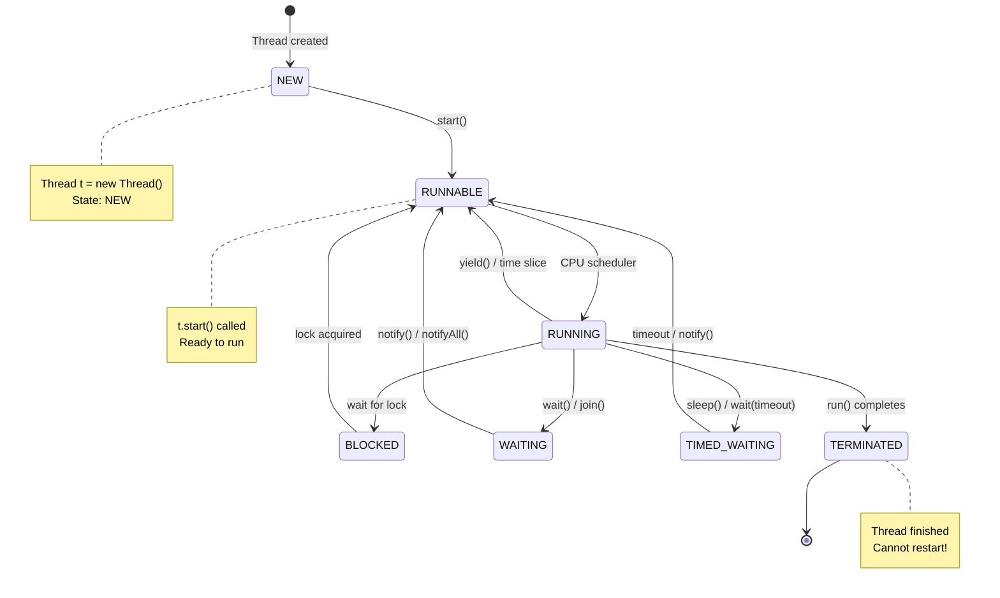
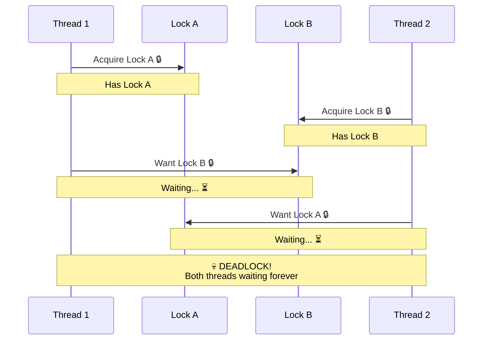

# 🎯 Day 13: Multithreading Part 1 - Visual Guide

## 📚 What You'll Learn Today

Multithreading is like having multiple chefs in a kitchen - they can work on different dishes at the same time!

---

## 🎨 Thread vs Process

```
╔══════════════════════════════════════════════════════════════╗
║                 PROCESS vs THREAD                             ║
╠══════════════════════════════════════════════════════════════╣
║                                                               ║
║  PROCESS 🏢                    THREAD 👤                     ║
║  ═══════════                    ══════════                    ║
║                                                               ║
║  ┌─────────────────┐          ┌──────────────┐              ║
║  │   Process 1     │          │   Process    │              ║
║  │  ┌───────────┐  │          │ ┌──────────┐ │              ║
║  │  │  Memory   │  │          │ │  Memory  │ │              ║
║  │  │  Space    │  │          │ │  Space   │ │              ║
║  │  └───────────┘  │          │ │ (Shared) │ │              ║
║  │  Code + Data    │          │ └──────────┘ │              ║
║  └─────────────────┘          │              │              ║
║                                │ Thread 1 ─┐  │              ║
║  ┌─────────────────┐          │ Thread 2 ─┼─ │  Shared     ║
║  │   Process 2     │          │ Thread 3 ─┘  │  Resources   ║
║  │  ┌───────────┐  │          └──────────────┘              ║
║  │  │  Memory   │  │                                         ║
║  │  │  Space    │  │                                         ║
║  │  └───────────┘  │          ✅ Lightweight                ║
║  │  Code + Data    │          ✅ Share memory               ║
║  └─────────────────┘          ✅ Fast context switch        ║
║                                ✅ Efficient communication    ║
║  ❌ Heavy weight                                             ║
║  ❌ Separate memory            ⚠️ Need synchronization      ║
║  ❌ Slow context switch        ⚠️ Shared state issues       ║
║  ❌ IPC needed                                               ║
║                                                               ║
╚══════════════════════════════════════════════════════════════╝
```

---

## 🔄 Thread Lifecycle



---

## 🎭 Thread Creation Methods

```
╔════════════════════════════════════════════════════════════════╗
║               5 WAYS TO CREATE THREADS                          ║
╠════════════════════════════════════════════════════════════════╣
║                                                                 ║
║  1️⃣ Extending Thread Class                                     ║
║  ──────────────────────────────────────                        ║
║  class MyThread extends Thread {                               ║
║      public void run() {                                       ║
║          // Thread code                                        ║
║      }                                                          ║
║  }                                                              ║
║  MyThread t = new MyThread();                                  ║
║  t.start();                                                     ║
║                                                                 ║
║  2️⃣ Implementing Runnable                                      ║
║  ──────────────────────────────────────                        ║
║  class MyRunnable implements Runnable {                        ║
║      public void run() {                                       ║
║          // Thread code                                        ║
║      }                                                          ║
║  }                                                              ║
║  Thread t = new Thread(new MyRunnable());                      ║
║  t.start();                                                     ║
║                                                                 ║
║  3️⃣ Anonymous Runnable                                         ║
║  ──────────────────────────────────────                        ║
║  Thread t = new Thread(new Runnable() {                        ║
║      public void run() {                                       ║
║          // Thread code                                        ║
║      }                                                          ║
║  });                                                            ║
║  t.start();                                                     ║
║                                                                 ║
║  4️⃣ Lambda Expression (Java 8+) 🎉                             ║
║  ──────────────────────────────────────                        ║
║  Thread t = new Thread(() -> {                                 ║
║      // Thread code                                            ║
║  });                                                            ║
║  t.start();                                                     ║
║                                                                 ║
║  5️⃣ Method Reference                                           ║
║  ──────────────────────────────────────                        ║
║  Thread t = new Thread(this::doWork);                          ║
║  t.start();                                                     ║
║                                                                 ║
║  💡 Runnable is preferred over Thread (composition > inheritance)║
╚════════════════════════════════════════════════════════════════╝
```

---

## ⚔️ Race Condition - The Problem

```
╔═══════════════════════════════════════════════════════════════╗
║                    RACE CONDITION DEMO                         ║
╠═══════════════════════════════════════════════════════════════╣
║                                                                ║
║  Shared Variable: count = 0                                   ║
║                                                                ║
║  Thread 1           │  Thread 2         │  Expected: 2        ║
║  ════════════       │  ════════════     │  Actual: 1 or 2 ?  ║
║                     │                   │                     ║
║  Read count (0)     │                   │  Time ──→          ║
║  count = 0 + 1      │                   │    │                ║
║                     │  Read count (0)   │    │                ║
║                     │  count = 0 + 1    │    │                ║
║  Write count = 1    │                   │    │                ║
║                     │  Write count = 1  │    │                ║
║                     │                   │    ▼                ║
║  Final count = 1  ❌ (Lost update!)                           ║
║                                                                ║
║                    ⬇️ SOLUTION: SYNCHRONIZATION ⬇️            ║
║                                                                ║
║  synchronized (lock) {                                        ║
║      count++;  // Atomic operation                            ║
║  }                                                             ║
║                                                                ║
║  Thread 1           │  Thread 2         │  Result: 2 ✅      ║
║  ════════════       │  ════════════     │                     ║
║  Lock acquired      │  Waiting... 🔒    │                     ║
║  Read count (0)     │  Waiting... 🔒    │                     ║
║  count = 0 + 1      │  Waiting... 🔒    │                     ║
║  Write count = 1    │  Waiting... 🔒    │                     ║
║  Lock released      │  Lock acquired 🔓 │                     ║
║                     │  Read count (1)   │                     ║
║                     │  count = 1 + 1    │                     ║
║                     │  Write count = 2  │                     ║
║  Final count = 2  ✅                                          ║
║                                                                ║
╚═══════════════════════════════════════════════════════════════╝
```

---

## 🔒 Synchronization Mechanisms

```
┌────────────────────────────────────────────────────────────┐
│              SYNCHRONIZATION OPTIONS                        │
├────────────────────────────────────────────────────────────┤
│                                                            │
│  1️⃣ Synchronized Method                                   │
│  ───────────────────────────────────────                  │
│  public synchronized void increment() {                   │
│      count++;  // Only one thread at a time               │
│  }                                                         │
│  🔒 Locks: Entire method                                  │
│  📌 Lock on: this (instance)                              │
│                                                            │
│  2️⃣ Synchronized Block                                    │
│  ───────────────────────────────────────                  │
│  public void increment() {                                │
│      synchronized(lock) {                                 │
│          count++;  // Fine-grained locking                │
│      }                                                     │
│  }                                                         │
│  🔒 Locks: Specific code block                            │
│  📌 Lock on: Custom object                                │
│                                                            │
│  3️⃣ Static Synchronized Method                            │
│  ───────────────────────────────────────                  │
│  public static synchronized void increment() {            │
│      staticCount++;                                       │
│  }                                                         │
│  🔒 Locks: Class level                                    │
│  📌 Lock on: Class object                                 │
│                                                            │
│  4️⃣ Volatile Variable                                     │
│  ───────────────────────────────────────                  │
│  private volatile boolean flag = false;                   │
│  // Ensures visibility across threads                     │
│  🔒 Locks: None (visibility only)                         │
│  📌 Use: Flags, state variables                           │
│                                                            │
└────────────────────────────────────────────────────────────┘
```

---

## 💀 Deadlock - The Nightmare



```
╔════════════════════════════════════════════════════════════════╗
║                  DEADLOCK PREVENTION                            ║
╠════════════════════════════════════════════════════════════════╣
║                                                                 ║
║  ❌ DEADLOCK CODE:                                             ║
║  ─────────────────────────────────────                         ║
║  Thread 1:                   Thread 2:                         ║
║  synchronized(lockA) {       synchronized(lockB) {             ║
║      synchronized(lockB) {       synchronized(lockA) {         ║
║          ...                         ...                       ║
║      }                           }                             ║
║  }                           }                                 ║
║  💀 Different lock order → DEADLOCK!                           ║
║                                                                 ║
║  ✅ SOLUTION - Same Lock Order:                                ║
║  ─────────────────────────────────────                         ║
║  Thread 1:                   Thread 2:                         ║
║  synchronized(lockA) {       synchronized(lockA) {  ✓ Same    ║
║      synchronized(lockB) {       synchronized(lockB) {  ✓ Order║
║          ...                         ...                       ║
║      }                           }                             ║
║  }                           }                                 ║
║  ✅ Consistent ordering → NO DEADLOCK!                         ║
║                                                                 ║
║  Prevention Strategies:                                         ║
║  1. Lock ordering - Always acquire in same order               ║
║  2. Lock timeout - Don't wait forever                          ║
║  3. Deadlock detection - Monitor and break                     ║
║  4. Avoid nested locks - Keep it simple                        ║
║                                                                 ║
╚════════════════════════════════════════════════════════════════╝
```

---

## 📞 Inter-Thread Communication

```
╔════════════════════════════════════════════════════════════════╗
║              WAIT-NOTIFY MECHANISM                              ║
╠════════════════════════════════════════════════════════════════╣
║                                                                 ║
║  Producer-Consumer Pattern                                      ║
║                                                                 ║
║  ┌──────────────┐      ┌──────────┐      ┌──────────────┐    ║
║  │   PRODUCER   │      │  BUFFER  │      │   CONSUMER   │    ║
║  │     🏭       │──→   │   📦     │   ←──│     🍽️       │    ║
║  └──────────────┘      └──────────┘      └──────────────┘    ║
║                                                                 ║
║  synchronized(buffer) {     synchronized(buffer) {             ║
║      while (buffer.isFull()) {  while (buffer.isEmpty()) {    ║
║          wait();  ⏸️               wait();  ⏸️                 ║
║      }                         }                               ║
║      buffer.add(item);         item = buffer.remove();        ║
║      notify();  📢             notify();  📢                   ║
║  }                         }                                   ║
║                                                                 ║
║  Timeline:                                                      ║
║  ─────────────────────────────────────────────────────         ║
║  1. Producer: Buffer full → wait()                             ║
║  2. Consumer: Takes item → notify()                            ║
║  3. Producer: Wakes up → Adds item                             ║
║  4. Producer: notify() → Wakes consumer                        ║
║  5. Consumer: Takes item → Process                             ║
║                                                                 ║
║  Methods (must be called within synchronized):                 ║
║  • wait()       - Release lock & wait                          ║
║  • notify()     - Wake one waiting thread                      ║
║  • notifyAll()  - Wake all waiting threads                     ║
║                                                                 ║
╚════════════════════════════════════════════════════════════════╝
```

---

## 🎯 ExecutorService - Thread Pool

```
┌──────────────────────────────────────────────────────────┐
│                 THREAD POOL PATTERN                       │
├──────────────────────────────────────────────────────────┤
│                                                          │
│  Without Thread Pool 😰                                 │
│  ──────────────────────────────────────                 │
│  for (Task task : tasks) {                              │
│      new Thread(task).start();  // Creates 1000 threads!│
│  }                                                       │
│  ❌ High memory usage                                   │
│  ❌ Thread creation overhead                            │
│  ❌ No task queueing                                    │
│                                                          │
│  With Thread Pool ✅                                    │
│  ──────────────────────────────────────                 │
│  ExecutorService pool = Executors.newFixedThreadPool(5);│
│  for (Task task : tasks) {                              │
│      pool.submit(task);  // Reuses 5 threads!          │
│  }                                                       │
│  ✅ Controlled thread count                             │
│  ✅ Reuses threads                                      │
│  ✅ Automatic task queueing                             │
│                                                          │
│  ┌─────────────────────────────────────────┐           │
│  │         Thread Pool (5 threads)         │           │
│  │   ┌────┬────┬────┬────┬────┐           │           │
│  │   │ T1 │ T2 │ T3 │ T4 │ T5 │           │           │
│  │   └────┴────┴────┴────┴────┘           │           │
│  │            ↑                            │           │
│  │         Task Queue                      │           │
│  │   [Task6][Task7][Task8]...[Task1000]  │           │
│  └─────────────────────────────────────────┘           │
│                                                          │
│  Types of Thread Pools:                                 │
│  • newFixedThreadPool(n)     - Fixed size               │
│  • newCachedThreadPool()     - Grows as needed          │
│  • newSingleThreadExecutor() - Single thread            │
│  • newScheduledThreadPool(n) - Scheduled tasks          │
│                                                          │
└──────────────────────────────────────────────────────────┘
```

---

## 📁 Examples in This Module

1. **Example01_ThreadCreation.java** - 5 ways to create threads
2. **Example02_ThreadLifecycle.java** - Thread states
3. **Example03_Synchronization.java** - Race conditions & sync
4. **Example04_DeadlockDemo.java** - Deadlock & prevention
5. **Example05_WaitNotify.java** - Inter-thread communication
6. **Example06_ExecutorService.java** - Thread pools
7. **Example07_ThreadPriority.java** - Priority scheduling
8. **Example08_ThreadInterrupt.java** - Interrupting threads
9. **Example09_VolatileKeyword.java** - Visibility guarantee

---

## 🚀 Quick Reference

```
╔════════════════════════════════════════════════════════╗
║          MULTITHREADING CHEAT SHEET                    ║
╠════════════════════════════════════════════════════════╣
║                                                        ║
║  Thread t = new Thread(() -> { ... });                ║
║  t.start();          // Start thread                  ║
║  t.join();           // Wait for completion           ║
║  t.interrupt();      // Interrupt thread              ║
║  Thread.sleep(ms);   // Sleep current thread          ║
║                                                        ║
║  synchronized(obj) { ... }  // Synchronize block      ║
║  public synchronized void m() { ... }  // Sync method ║
║                                                        ║
║  obj.wait();         // Release lock & wait           ║
║  obj.notify();       // Wake one thread               ║
║  obj.notifyAll();    // Wake all threads              ║
║                                                        ║
║  ExecutorService pool = Executors.newFixedThreadPool(5);║
║  pool.submit(runnable);   // Submit task              ║
║  pool.shutdown();         // Shutdown pool            ║
║                                                        ║
╚════════════════════════════════════════════════════════╝
```

Happy Threading! 🧵
