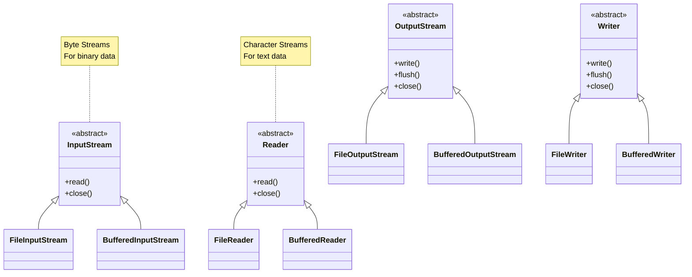
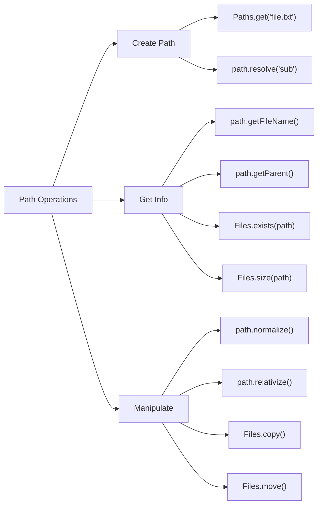

# 🎯 Day 15: File I/O & Serialization - Visual Guide

## 📚 What You'll Learn Today

File I/O is like reading books and writing diaries - store and retrieve information!

---

## 🎨 I/O Streams Hierarchy



---

## 📊 Byte Streams vs Character Streams

```
╔════════════════════════════════════════════════════════════════╗
║              BYTE STREAMS vs CHARACTER STREAMS                  ║
╠════════════════════════════════════════════════════════════════╣
║                                                                 ║
║  BYTE STREAMS 📦                │    CHARACTER STREAMS 📝       ║
║  ════════════════                │    ═══════════════════       ║
║                                  │                              ║
║  InputStream / OutputStream      │    Reader / Writer           ║
║                                  │                              ║
║  • FileInputStream               │    • FileReader              ║
║  • FileOutputStream              │    • FileWriter              ║
║  • BufferedInputStream           │    • BufferedReader          ║
║  • BufferedOutputStream          │    • BufferedWriter          ║
║  • DataInputStream               │    • InputStreamReader       ║
║  • DataOutputStream              │    • OutputStreamWriter      ║
║                                  │                              ║
║  Data Unit: byte (8 bits)        │    Data Unit: char (16 bits) ║
║                                  │                              ║
║  Best For:                       │    Best For:                 ║
║  ✓ Binary files                  │    ✓ Text files              ║
║  ✓ Images, audio, video          │    ✓ CSV, JSON, XML          ║
║  ✓ Serialized objects            │    ✓ Log files               ║
║  ✓ Any non-text data             │    ✓ Configuration files     ║
║                                  │                              ║
║  Example:                        │    Example:                  ║
║  FileInputStream fis =           │    FileReader fr =           ║
║      new FileInputStream(file);  │        new FileReader(file); ║
║  int byte = fis.read();          │    int char = fr.read();     ║
║                                  │                              ║
╚════════════════════════════════════════════════════════════════╝
```

---

## 🎬 File Reading Process

```
┌──────────────────────────────────────────────────────────┐
│               FILE READING JOURNEY                        │
├──────────────────────────────────────────────────────────┤
│                                                          │
│  1. Open File 📂                                         │
│     FileReader fr = new FileReader("data.txt");         │
│     Status: [OPEN] ✓                                    │
│                                                          │
│  2. Read Data 📖                                         │
│     int ch = fr.read();  // One character               │
│     while (ch != -1) {   // -1 = End of file           │
│         // Process character                            │
│         ch = fr.read();                                 │
│     }                                                    │
│     Status: [READING] 📚                                │
│                                                          │
│  3. Close File 🔒                                        │
│     fr.close();                                         │
│     Status: [CLOSED] ✓                                  │
│                                                          │
│  Problem: What if exception occurs before close()? 😱   │
│                                                          │
│  Solution: Try-with-resources! 🎉                       │
│     try (FileReader fr = new FileReader("data.txt")) {  │
│         // Read data                                    │
│     }  // Auto-closes! 🪄                               │
│                                                          │
└──────────────────────────────────────────────────────────┘
```

---

## 🚀 Buffered I/O - The Speedster

```
╔════════════════════════════════════════════════════════════════╗
║                 UNBUFFERED vs BUFFERED I/O                      ║
╠════════════════════════════════════════════════════════════════╣
║                                                                 ║
║  UNBUFFERED 🐌 (Slow - Many Disk Accesses)                     ║
║  ══════════════════════════════════════                        ║
║                                                                 ║
║  Program ─┬→ Disk Read ('H')                                   ║
║           ├→ Disk Read ('e')                                   ║
║           ├→ Disk Read ('l')                                   ║
║           ├→ Disk Read ('l')                                   ║
║           └→ Disk Read ('o')                                   ║
║                                                                 ║
║  Disk Access: 5 times for "Hello" 😰                          ║
║                                                                 ║
║  ─────────────────────────────────────────────                ║
║                                                                 ║
║  BUFFERED ⚡ (Fast - Batch Disk Access)                        ║
║  ═══════════════════════════════                              ║
║                                                                 ║
║  Program ──→ Buffer ──→ Disk Read (8KB chunk)                 ║
║     ↑          │                                               ║
║     └──────────┘ Read from buffer (in memory)                 ║
║                                                                 ║
║  ┌──────────────────────────────────────┐                     ║
║  │    Buffer (8KB in memory)            │                     ║
║  │  "Hello World and more text..."      │                     ║
║  └──────────────────────────────────────┘                     ║
║                                                                 ║
║  Disk Access: 1 time for many chars! 🎉                       ║
║                                                                 ║
║  Usage:                                                         ║
║  BufferedReader br = new BufferedReader(                       ║
║      new FileReader("data.txt")                                ║
║  );                                                             ║
║  String line = br.readLine();  // Read entire line!            ║
║                                                                 ║
║  Performance: 10-100x faster! ⚡                               ║
║                                                                 ║
╚════════════════════════════════════════════════════════════════╝
```

---

## 🎁 Serialization - Object to Bytes

```
┌──────────────────────────────────────────────────────────┐
│              SERIALIZATION PROCESS                        │
├──────────────────────────────────────────────────────────┤
│                                                          │
│  JAVA OBJECT  →  SERIALIZE  →  BYTE STREAM  →  FILE     │
│                                                          │
│  ┌─────────────┐                ┌───────────────┐       │
│  │   Person    │   Serialize    │  01010101010  │       │
│  ├─────────────┤      →         │  11001100110  │       │
│  │ name: Alice │                │  00110011001  │       │
│  │ age: 30     │                │  ...          │       │
│  │ city: NYC   │                └───────────────┘       │
│  └─────────────┘                                        │
│                                                          │
│  FILE  →  BYTE STREAM  →  DESERIALIZE  →  JAVA OBJECT   │
│                                                          │
│  ┌───────────────┐              ┌─────────────┐        │
│  │  01010101010  │  Deserialize │   Person    │        │
│  │  11001100110  │      →       ├─────────────┤        │
│  │  00110011001  │              │ name: Alice │        │
│  │  ...          │              │ age: 30     │        │
│  └───────────────┘              │ city: NYC   │        │
│                                 └─────────────┘        │
│                                                          │
│  Requirements:                                           │
│  class Person implements Serializable {                 │
│      private static final long serialVersionUID = 1L;   │
│      private String name;                               │
│      private int age;                                   │
│      private transient String password;  // Not saved!  │
│  }                                                       │
│                                                          │
└──────────────────────────────────────────────────────────┘
```

---

## 🗺️ Old I/O vs NIO (New I/O)

```
╔════════════════════════════════════════════════════════════════╗
║                   java.io vs java.nio.file                      ║
╠════════════════════════════════════════════════════════════════╣
║                                                                 ║
║  OLD (java.io) 📁                │    NEW (java.nio) 🚀        ║
║  ════════════════                │    ═══════════════          ║
║                                  │                              ║
║  File file = new File(path);     │    Path path = Paths.get(); ║
║                                  │                              ║
║  FileReader fr =                 │    List<String> lines =     ║
║      new FileReader(file);       │        Files.readAllLines(  ║
║  BufferedReader br =             │            path);            ║
║      new BufferedReader(fr);     │    // One line! 🎉          ║
║  String line;                    │                              ║
║  while ((line = br.readLine())   │                              ║
║          != null) {              │                              ║
║      // Process                  │                              ║
║  }                               │                              ║
║  br.close();                     │                              ║
║  // Many lines 😰                │                              ║
║                                  │                              ║
║  Features:                       │    Features:                 ║
║  • Stream-based                  │    • Buffer-based            ║
║  • Blocking I/O                  │    • Non-blocking I/O        ║
║  • One byte/char at a time       │    • Batch operations        ║
║  • Manual buffer management      │    • Auto buffer management  ║
║                                  │    • Better performance      ║
║                                  │    • More file operations    ║
║                                  │    • Watch service           ║
║                                  │    • Symbolic links support  ║
║                                                                 ║
╚════════════════════════════════════════════════════════════════╝
```

---

## 🎯 Common File Operations

```
┌──────────────────────────────────────────────────────────┐
│              FILE OPERATIONS CHEAT SHEET                  │
├──────────────────────────────────────────────────────────┤
│                                                          │
│  READ TEXT FILE 📖                                       │
│  ────────────────────────────────────                   │
│  try (BufferedReader br = new BufferedReader(           │
│          new FileReader("file.txt"))) {                 │
│      String line;                                       │
│      while ((line = br.readLine()) != null) {           │
│          System.out.println(line);                      │
│      }                                                   │
│  }                                                       │
│                                                          │
│  WRITE TEXT FILE ✍️                                      │
│  ────────────────────────────────────                   │
│  try (BufferedWriter bw = new BufferedWriter(           │
│          new FileWriter("file.txt"))) {                 │
│      bw.write("Hello World");                           │
│      bw.newLine();                                      │
│  }                                                       │
│                                                          │
│  READ WITH NIO 🚀                                       │
│  ────────────────────────────────────                   │
│  Path path = Paths.get("file.txt");                    │
│  List<String> lines = Files.readAllLines(path);        │
│  // All lines in one shot!                             │
│                                                          │
│  WRITE WITH NIO 🚀                                      │
│  ────────────────────────────────────                   │
│  List<String> lines = Arrays.asList("Line 1", "Line 2");│
│  Files.write(path, lines);                              │
│  // All lines in one shot!                             │
│                                                          │
│  SERIALIZE OBJECT 📦                                     │
│  ────────────────────────────────────                   │
│  try (ObjectOutputStream oos = new ObjectOutputStream(  │
│          new FileOutputStream("obj.ser"))) {            │
│      oos.writeObject(person);                           │
│  }                                                       │
│                                                          │
│  DESERIALIZE OBJECT 📦                                   │
│  ────────────────────────────────────                   │
│  try (ObjectInputStream ois = new ObjectInputStream(    │
│          new FileInputStream("obj.ser"))) {             │
│      Person p = (Person) ois.readObject();              │
│  }                                                       │
│                                                          │
└──────────────────────────────────────────────────────────┘
```

---

## 🎬 Path Operations



---

## 📁 Examples in This Module

1. **Example01_FileReadWrite.java** - Basic file I/O
2. **Example02_NIOFiles.java** - Modern NIO operations
3. **Example03_Serialization.java** - Object persistence
4. **Example04_ByteStreams.java** - Binary data handling
5. **Example05_PathOperations.java** - Path manipulation

---

## 🚀 Quick Reference

```
╔════════════════════════════════════════════════════════════╗
║              FILE I/O CHEAT SHEET                          ║
╠════════════════════════════════════════════════════════════╣
║                                                            ║
║  // Read text file                                        ║
║  BufferedReader br = new BufferedReader(                  ║
║      new FileReader("file.txt"));                         ║
║  String line = br.readLine();                             ║
║                                                            ║
║  // Write text file                                       ║
║  BufferedWriter bw = new BufferedWriter(                  ║
║      new FileWriter("file.txt"));                         ║
║  bw.write("Hello");                                       ║
║  bw.newLine();                                            ║
║                                                            ║
║  // NIO - Read all lines                                  ║
║  Path path = Paths.get("file.txt");                       ║
║  List<String> lines = Files.readAllLines(path);           ║
║                                                            ║
║  // NIO - Write all lines                                 ║
║  Files.write(path, lines);                                ║
║                                                            ║
║  // Serialize object                                      ║
║  ObjectOutputStream oos = ...                             ║
║  oos.writeObject(obj);                                    ║
║                                                            ║
║  // Deserialize object                                    ║
║  ObjectInputStream ois = ...                              ║
║  Object obj = ois.readObject();                           ║
║                                                            ║
╚════════════════════════════════════════════════════════════╝
```

Happy File I/O! 📂
